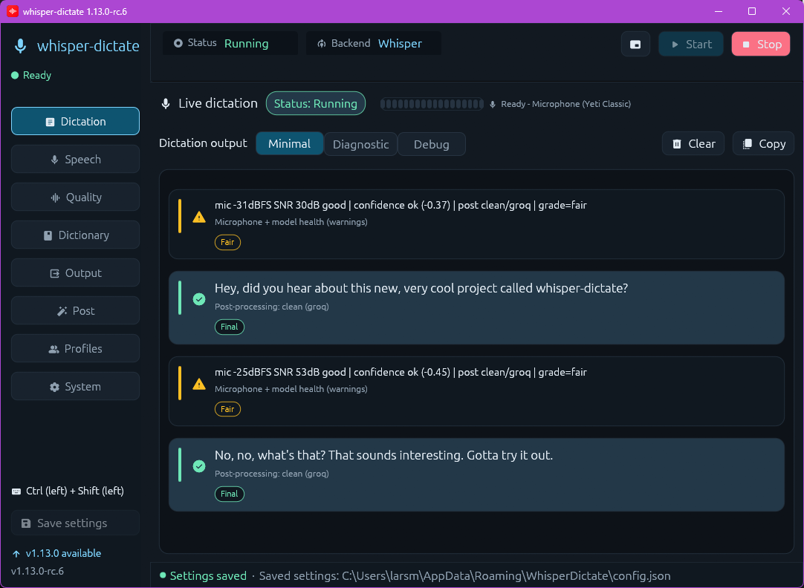

<p align="center">
  
</p>

<h1 align="center">whisper-dictate</h1>

<p align="center"><strong>Speak prompts instead of typing them.</strong></p>

<p align="center">
  
</p>

whisper-dictate is app-agnostic push-to-talk dictation. Hold a key, speak,
release, and the text is inserted into the focused window: Codex, Claude Code,
a terminal, a browser, an editor, anything.

The default speech engine is local Whisper, so normal dictation does not send
audio to a cloud service. Optional cloud and self-hosted backends are available
when you explicitly choose them.

## Start Dictating

1. **Install**
   - Windows: download the installer from the
     [latest release](https://github.com/FactusConsulting/whisper-dictate/releases/latest),
     or use Chocolatey:

     ```powershell
     choco source add -n=whisper-dictate -s="https://factusconsulting.github.io/whisper-dictate/chocolatey/index.json"
     choco install whisper-dictate --source=whisper-dictate -y
     ```

   - Ubuntu Wayland:

     ```bash
     brew tap factusconsulting/tap
     brew install whisper-dictate
     whisper-dictate setup-ubuntu
     ```

   - Nix:

     ```bash
     nix run github:FactusConsulting/whisper-dictate -- run --key f9 --lang en
     ```

2. **Open the app**
   - Windows: Start menu -> **whisper-dictate**
   - Linux: run `whisper-dictate ui`

3. **Pick only the basics**
   - microphone
   - push-to-talk key
   - spoken language

4. **Use it**
   Click **Start**, focus the app you want to dictate into, then hold the key,
   speak, and release.

The three first-run settings are enough for most people. Everything else has a
default.

## Need More?

| Task | Go here |
|---|---|
| Platform-specific installs, Chocolatey, winget, Nix, Linux X11 | [docs/INSTALLATION.md](docs/INSTALLATION.md) |
| Every setting, CLI flag, recipes, dictionary, profiles, cloud/STT backends | [docs/CONFIGURATION.md](docs/CONFIGURATION.md) |
| Microphone quality, SNR, quiet/noisy input | [docs/MICROPHONE.md](docs/MICROPHONE.md) |
| Architecture and platform internals | [docs/TECHNICAL.md](docs/TECHNICAL.md) |
| Development and tests | [CONTRIBUTING.md](CONTRIBUTING.md) |
| Releases and local installer builds | [docs/RELEASING.md](docs/RELEASING.md) |

## CLI

The UI is the easiest path. For terminal use:

```bash
whisper-dictate run --key f9 --lang en
```

Common examples:

```powershell
whisper-dictate run --key ctrl_r --lang da
whisper-dictate.exe run --key ctrl_r --lang da --device cuda
whisper-dictate doctor
```

On Windows, the normal **whisper-dictate** shortcut runs the Rust UI and starts
the Python worker hidden underneath it, with logs streamed into the Dictation
tab.

## Supported Platforms

| Platform | Best start |
|---|---|
| Windows 10 / 11 | Installer or Chocolatey |
| Ubuntu 24.04 / 26.04 Wayland | Homebrew + `whisper-dictate setup-ubuntu` |
| Linux X11 | Release zip or source install |
| NixOS / Nix | Flake package or NixOS module |

See [docs/INSTALLATION.md](docs/INSTALLATION.md) for details, including
Chocolatey source management, local winget manifests, portable zips, and Linux
desktop entries.

## Tests

```bash
python -m pytest src/python/tests src/tests/python -q
```

For Rust, clippy/fmt, and a CI-matched environment, use the dev container in
[CONTRIBUTING.md](CONTRIBUTING.md).

## Build features

The Rust crate exposes a small set of opt-in cargo features beyond the
default UI build:

| Feature              | Default | What it does |
|----------------------|---------|--------------|
| `ui-egui-glow`       | yes     | egui via the glow (OpenGL) backend — shipping renderer. |
| `ui-egui-wgpu`       | no      | egui via the wgpu backend — continuously-validated exit route. |
| `whisper-rs-local`   | no      | Compiles in [whisper-rs] (whisper.cpp bindings) for local CPU inference. See below. |
| `audio-in-rust`      | no      | Compiles in the Rust-side capture pipeline (cpal + Silero VAD). Opt-in at runtime via `VOICEPI_AUDIO_BACKEND=rust`. See below. |

[whisper-rs]: https://crates.io/crates/whisper-rs

### Rust audio capture (experimental)

Behind the **`audio-in-rust`** cargo feature, the crate ships a self-contained
audio capture pipeline (cpal microphone capture → rubato resample → Silero v4
VAD → JSON-line events). When the runtime supervisor launches the Python
worker, it spawns the pipeline in a worker thread and pipes encoded frames
into the worker's stdin (the worker reads them via `RustStdinAudioSource`
instead of opening sounddevice).

To enable for a build:

```bash
cargo build --manifest-path src/rust/Cargo.toml --features audio-in-rust --release
```

At runtime, opt in by exporting the env var **before** launching the app:

```bash
export VOICEPI_AUDIO_BACKEND=rust   # bash / Linux / macOS
$env:VOICEPI_AUDIO_BACKEND = "rust" # PowerShell / Windows
```

Default builds and the unset / non-`rust` env value go through the existing
Python sounddevice path unchanged — there is no behaviour change for users who
haven't both compiled the feature in and set the env var. To roll back at
runtime, unset the env var (the supervisor logs which path is active on every
worker start). The feature is Phase 1 (single-utterance capture + frame
forwarding); follow-up work will surface the Rust VAD's utterance boundaries.

### Local Whisper (experimental)

Behind the **`whisper-rs-local`** cargo feature, the crate ships a
small `whisper` module that loads a GGML Whisper model and transcribes
a 16 kHz mono WAV (originally the CPU-only spike from roadmap issue
[#317] sub-task 1). As of Phase 1.2 of the Python-removal roadmap
([#348]), it is *optionally* wired into the runtime: when the binary is
built with `--features whisper-rs-local` AND the runtime is launched
with `VOICEPI_TRANSCRIBE_BACKEND=rust`, local Whisper transcription
dispatches through the Rust helper (`whisper-dictate transcribe-wav`)
instead of the in-process faster-whisper bindings. Without the
env-var opt-in, behaviour is byte-identical to a stock build. The Rust
backend reads the model file path from `VOICEPI_WHISPER_MODEL_PATH` (no
default — set it explicitly to a `ggml-*.bin` file); the Python
orchestrator still owns the rest of the post-flow (dictionary, redaction,
injection).

> **Model format:** only the GGML container (`ggml-*.bin`) works.
> whisper.cpp does not yet read llama.cpp's newer GGUF format, and
> loading a `.gguf` file is rejected up front with a clean error.

#### Idle model unload (library primitive — not yet active)

A loaded GGML model holds 1-2 GB resident (≈75 MB for `tiny`, ~1.5 GB
for `medium`). The library primitive `whisper::IdleUnloadingModel`
wraps a loaded model behind a background watcher that drops it after a
configurable idle window; the next transcribe call transparently
reloads from disk. The intended knob is
**`VOICEPI_WHISPER_IDLE_UNLOAD_S`** (seconds; `0` or unset = never
unload; recommended values once wired: `30`, `300`, `1800`, `3600`;
negative, non-numeric, or non-UTF-8 values are rejected so a typo in
the wrapper that sets the variable surfaces loudly rather than
silently falling back to "never").

**Status: the wrapper is landed but not yet wired into the active
transcribe path.** Today's `VOICEPI_TRANSCRIBE_BACKEND=rust` dispatcher
spawns a fresh `whisper-dictate transcribe-wav` subprocess per
utterance (so the model never lives between calls regardless of this
setting). Setting `VOICEPI_WHISPER_IDLE_UNLOAD_S` has no runtime
effect until the future in-process worker port consumes
`IdleUnloadingModel`; until then this section documents the contract
that worker will honour, not behaviour you can opt into yet.

Enabling the feature pulls in whisper.cpp and compiles it from source,
*and* runs `bindgen` against whisper.cpp's headers — so the build host
needs both a C/C++ toolchain *and* the libclang shared library that
bindgen links against:

- **Linux / WSL:** `cmake`, `clang`, **`libclang-dev`**
  (Debian/Ubuntu: `apt install cmake clang libclang-dev`; equivalent
  packages on other distros). The libclang dev package is the usual
  blocker — it ships the headers bindgen needs, not just the `clang`
  binary.
- **macOS:** install the Xcode command-line tools
  (`xcode-select --install`) — they bundle clang, libclang and the
  build essentials. Install `cmake` via Homebrew (`brew install
  cmake`).
- **Windows:** three things — Rust's default `x86_64-pc-windows-msvc`
  target builds whisper.cpp from source via CMake using the **MSVC**
  toolchain (`cl.exe` / `link.exe`), then `bindgen` runs against
  whisper.cpp's headers using `libclang.dll`:
  1. [Visual Studio Build Tools] with the **"Desktop development with
     C++"** workload (this ships `cl.exe`, `link.exe`, `rc.exe` and the
     Windows SDK that CMake's MSVC generator needs). The "Build Tools"
     standalone installer is enough — full Visual Studio is not
     required. LLVM/clang alone will *not* satisfy the default Rust
     target; `bindgen` still fails further down if MSVC is missing.
  2. [CMake] on `PATH`.
  3. [LLVM] (the LLVM installer adds `libclang.dll`; if bindgen can't
     find it, point at the install dir with
     `LIBCLANG_PATH=C:\Program Files\LLVM\bin`).

  The pre-built installer for the app shipped from CI does **not**
  include local Whisper — this section is for developers building from
  source with `--features whisper-rs-local`.

(The `.devcontainer/` image already includes all of the Linux deps
above, so the easiest path on any host is `devcontainer up` and build
inside it.)

Grab a model from the [whisper.cpp release page on Hugging Face][whisper-models]
— `ggml-tiny.en.bin` (~75 MB) is enough to validate the integration.
Make sure you download the **GGML** variant (filename starts with
`ggml-` and ends with `.bin`); GGUF variants will be rejected.

[CMake]: https://cmake.org/download/
[LLVM]: https://releases.llvm.org/download.html
[Visual Studio Build Tools]: https://visualstudio.microsoft.com/downloads/?q=build+tools

Run the example against a 16 kHz mono WAV:

```bash
cargo run --release \
    --manifest-path src/rust/Cargo.toml \
    --features whisper-rs-local \
    --example whisper_local -- \
    --model /path/to/ggml-tiny.en.bin \
    --wav   /path/to/audio_16khz_mono.wav \
    # --language da   # optional; omit or "auto" → auto-detect
```

The unit test `transcribes_hello_world_when_model_available` skips
unless both `WHISPER_TEST_MODEL_PATH` and `WHISPER_TEST_WAV_PATH` are
set, so CI is unaffected.

[#317]: https://github.com/FactusConsulting/whisper-dictate/issues/317
[#348]: https://github.com/FactusConsulting/whisper-dictate/issues/348
[whisper-models]: https://huggingface.co/ggerganov/whisper.cpp

## License

MIT - see [LICENSE](LICENSE).
