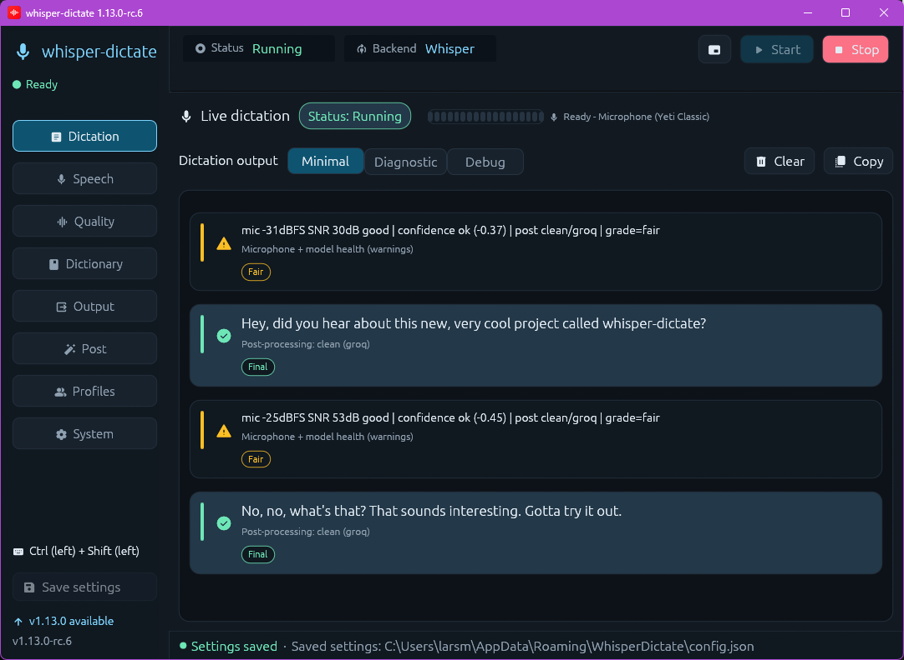

<p align="center">
  
</p>

<h1 align="center">whisper-dictate</h1>

<p align="center"><strong>Speak prompts instead of typing them.</strong></p>

<p align="center">
  
</p>

whisper-dictate is app-agnostic push-to-talk dictation. Hold a key, speak,
release, and the text is inserted into the focused window: a terminal, browser,
editor, chat app, or any other text field.

Local Whisper is the default speech engine, so normal dictation keeps audio on
your computer. OpenAI, Groq, NVIDIA Nemotron 3.5 ASR, and custom
OpenAI-compatible endpoints are
available when you explicitly select cloud speech recognition.

## Start dictating

1. **Install**

   - Windows: download the installer from the
     [latest release](https://github.com/FactusConsulting/whisper-dictate/releases/latest),
     or use Chocolatey:

     ```powershell
     choco source add -n=whisper-dictate -s="https://factusconsulting.github.io/whisper-dictate/chocolatey/index.json"
     choco install whisper-dictate --source=whisper-dictate -y
     ```

   - Ubuntu Wayland:

     ```bash
     brew tap factusconsulting/tap
     brew install whisper-dictate
     wd setup-ubuntu
     ```

   - Nix:

     ```bash
     nix run github:FactusConsulting/whisper-dictate -- run --key f9 --lang en
     ```

2. **Open the app**

   - Windows: open **whisper-dictate** from the Start menu.
   - Linux: run `wd ui`.

3. **Choose your microphone, push-to-talk key, and spoken language.**

4. **Download the selected local model.** On a clean installation, use the
   Download action on the Runtime screen and wait for verification to finish.
   Cloud speech recognition does not require a local model.

5. **Click Start.** Focus the app where you want the text, hold the configured
   key while speaking, and release it to transcribe and insert the result.

Everything else has a default.

## Terminal use

The UI is the easiest path. The same native runtime is available from a
terminal:

```bash
wd run --key f9 --lang en
```

Useful diagnostics and one-shot commands:

```powershell
wd doctor
wd setup
wd calibrate-mic 5 --json
wd transcribe-file .\recording.wav --json
wd models list
```

`transcribe-file` accepts a 16 kHz mono WAV. Use the configuration reference
for all commands, flags, settings, dictionary options, and backend recipes.

## Supported platforms

| Platform | Recommended installation |
|---|---|
| Windows 10 / 11 | Installer or Chocolatey |
| Ubuntu 24.04 / 26.04 Wayland | Homebrew plus `wd setup-ubuntu` |
| Linux X11 | Release archive or source installer |
| NixOS / Nix | Flake package or NixOS module |

## Documentation

| Task | Documentation |
|---|---|
| Install on Windows, Linux, or Nix | [Installation](docs/INSTALLATION.md) |
| Configure settings, commands, profiles, or post-processing | [Configuration reference](docs/CONFIGURATION.md) |
| Choose local or cloud speech recognition | [Speech-to-text backends](docs/STT_BACKENDS.md) |
| Diagnose microphone quality | [Microphone guide](docs/MICROPHONE.md) |
| Understand the native runtime | [Architecture](docs/ARCHITECTURE.md) |
| Build, test, or contribute | [Contributing](CONTRIBUTING.md) |

## License

MIT - see [LICENSE](LICENSE).
